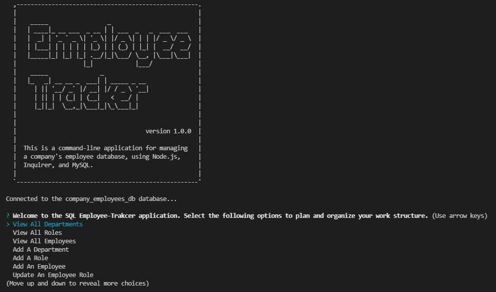
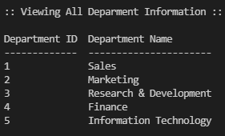
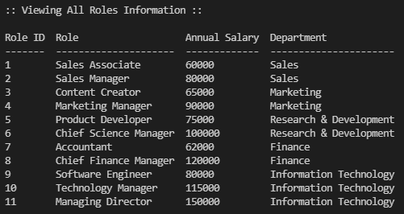
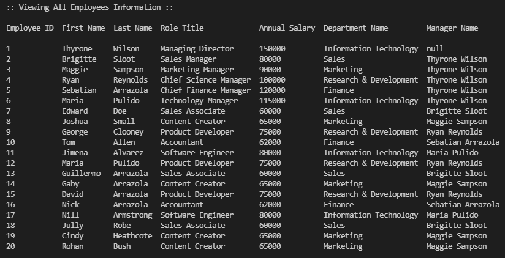
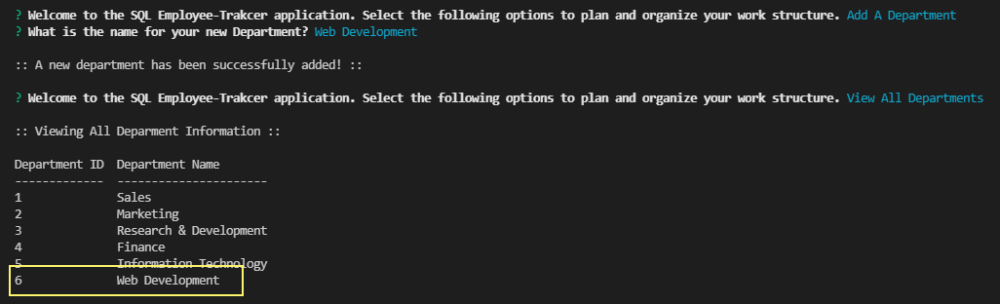
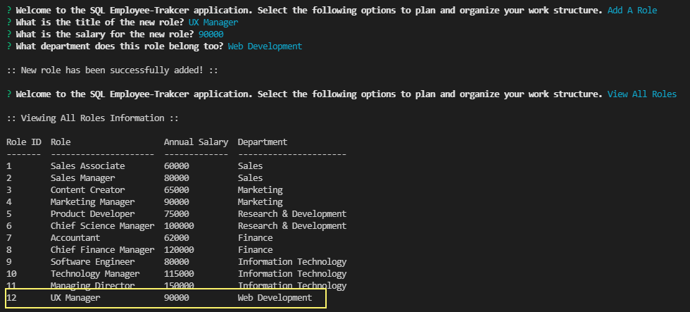
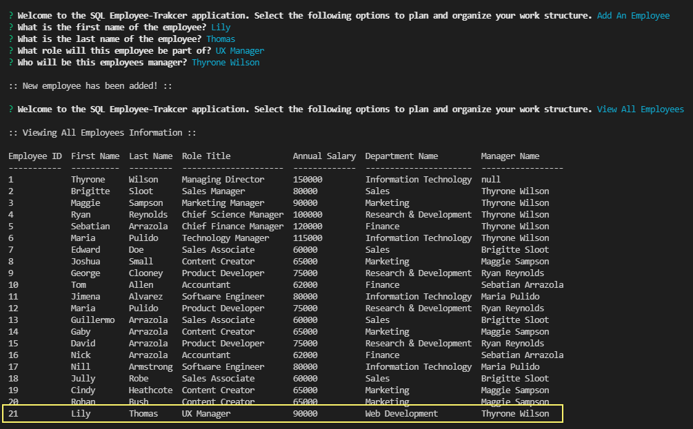
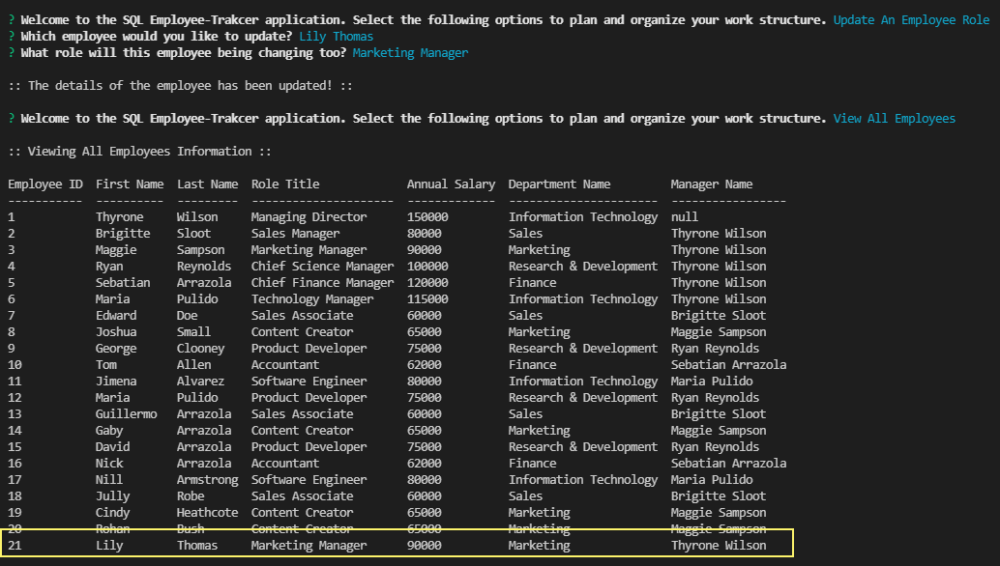

# 12 SQL: Employee Tracker

## Description
Developers frequently have to create interfaces that allow non-developers to easily view and interact with information stored in databases. These interfaces are called content management systems (CMS). This week we were tasked to build a command-line application from scratch to manage a company's employee database, using Node.js, Inquirer, and MySQL.

This was another imporant excercise as it was an opportunity to implement the skills and knowledge we had learnt over the past week about MySQL. In addition it provided another platform for the continue development of Node.js and the dependency 'inquirer'.

To see how the application works click on [View Application Demo](https://drive.google.com/file/d/1KFvfxY31NeAAcPYBhmbhvU-mKF-AlwjT/view?usp=sharing).

## Table of Contents 
- [Installation](#installation)
- [Usage](#usage)
- [Features](#features)
- [Contribute](#contribute)
- [License](#license)
- [Application-Demo](#Application-Demo)

## Installation
Users can download or clone this repository. In order to run the project, please follow the following steps:

* Navigate to the project folder and run the command 'npm install' or 'npm i'.

* open mysql by typing 'mysql -u root -p' and enter your mysql password.

* Run 'source db/schema.sql' to initialise the database.

* Run 'source db/seeds.sql' to pass the values to the database.

* Run 'node server.js' to start the application.

## Usage

* Once the application is open, users can see the following screen with set of questions:

  

* View all departments

  

* View all roles

  

* View all employees

  

* Add a department

  

* Add a role

  

* Add an employee

  

* Update an employee role

  

## Features
- Node.js
- Inquirer
- MySQL 
- asciiart-logo 
- console.table 
- dotenv 

## Contribute
If you would like to contribute to this project please contact me via email at ajaycoolkarni@yahoo.com

## License
This project is released under the [ISC LICENSE](https://img.shields.io/badge/License-ISC-blue.svg)

## Application-Demo
This project is released under the [Application Demo](https://drive.google.com/file/d/1KFvfxY31NeAAcPYBhmbhvU-mKF-AlwjT/view?usp=sharing)